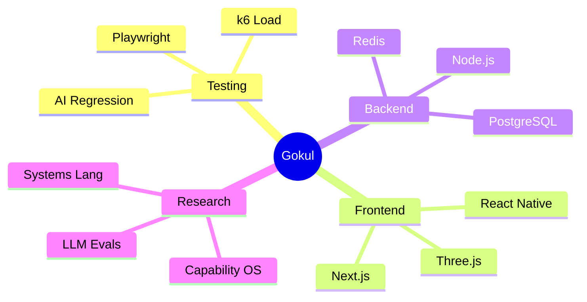

<p align="center">
  
</p>

---

## About

I build production software across three disciplines that most teams treat as separate: test architecture, full-stack product engineering, and AI-native tooling. My current work spans quality frameworks, enterprise web applications, and research into foundational computing systems.

I am in the research and architecture phase of designing two interconnected systems — a capability-based operating system and a programming language — addressing problems that existing tools have inherited from 1970s design decisions rather than solved.

---

## 🖥️ System Status

| Project | Build | Coverage | Uptime |
|---------|-------|----------|--------|
| [ProbeAI](https://github.com/gokulsenthilkumar3/ProbeAI) |  |  |  |
| [NexFlow](https://github.com/gokulsenthilkumar3/NexFlow) |  |  |  |
| [MathShield-CDN](https://github.com/gokulsenthilkumar3/MathShield-CDN) |  |  |  |
| [VaultIQ](https://github.com/gokulsenthilkumar3/VaultIQ) |  |  |  |
| [Yarn-Management](https://github.com/gokulsenthilkumar3/Yarn-Management) |  |  |  |
| [Portfolio](https://github.com/gokulsenthilkumar3/Portfolio) |  |  |  |

---

## 🧬 Skill Topology



---

## 🔬 Research

<details>
<summary>🔬 Research Lab — Click to enter</summary>

```text
$ gokul --research status

[OS]   CapabilityKernel v0.3-alpha
       ├─ Threat Model: ████████░░ 80%
       ├─ Microkernel RFC: ██████░░░░ 60%
       └─ AI Scheduler: ████░░░░░░ 40%

[LANG] GradualSys v0.1-spec
       ├─ Type System: ██████████ 100%
       ├─ Compiler Design: █████░░░░░ 50%
       └─ Package Manager: ███░░░░░░░ 30%
```

</details>

### Why a New Language?

No existing language scores above 7 across all critical dimensions simultaneously. The chart below maps the design gap:


*Radar chart: 9 design dimensions scored 0–10. No existing language reaches ≥8 across all axes simultaneously.*

### How Long Does It Take?

Every language that became industry-defining solved a felt pain and then took years for the ecosystem to form around it:


*Timeline: creation year → mainstream adoption milestone. Diamond marker = mainstream. Dashed line = now (2026).*

---

## ⚙️ Engineering Philosophy

```ts
const engineer = {
  testability: "design constraint, not afterthought",
  performance: {
    belongs: "in CI pipelines",
    not: "post-mortems"
  },
  quality: {
    source: "architecture decisions",
    not: "bolt-on QA phase"
  },
  currently_building: ["CapabilityOS", "GradualSys lang"],
  open_to: ["SDET roles", "Founding Engineer", "AI Quality"]
};
```

---

## ⏱️ This Week's Build Time

[](https://wakatime.com/@gokulsenthilkumar3)

---

## 🐍 Contribution Trail

<picture>
  <source media="(prefers-color-scheme: dark)" srcset="https://raw.githubusercontent.com/gokulsenthilkumar3/gokulsenthilkumar3/output/github-contribution-grid-snake-dark.svg">
  
</picture>

---

<p align="center">
  
</p>

<p align="center">
  <a href="mailto:gokulsenthilkumar3@gmail.com"></a>
  <a href="https://github.com/gokulsenthilkumar3"></a>
</p>
