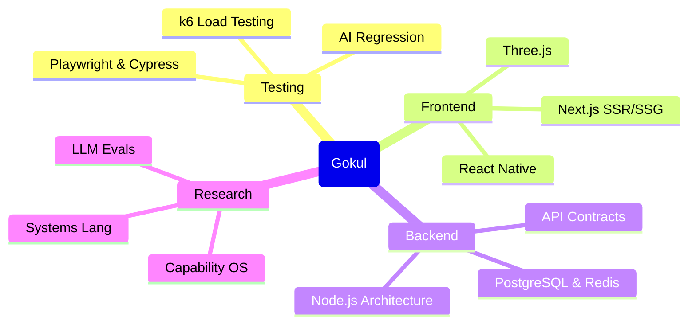

<!-- markdownlint-disable MD033 MD041 -->
<!--
  🚀 GOKUL SENTHILKUMAR – PROFILE README v4
  Elite SDET + Full-Stack Engineer • Product & Testing Focused
-->

<div align="center">

  <h1 align="center">Gokul Senthilkumar</h1>
  
  <br/>

  <!-- Dynamic Animated Typing -->
  [](https://github.com/gokulsenthilkumar3)

  <br/>

  <!-- Social & Contact Bar -->
  <p align="center">
    <a href="mailto:gokulsenthilkumar3@gmail.com">
      
    </a>
    <a href="https://linkedin.com/in/gokulsenthilkumar3">
      
    </a>
    <a href="./resume.pdf">
      
    </a>
  </p>

</div>

---

## 💎 Who I Am

I am a **Software Development Engineer in Test (SDET)** and **Full‑Stack Developer** from Tamil Nadu, India 🇮🇳, building systems where quality, performance, and developer experience are first‑class features. My work lives at the intersection of product‑grade web apps, advanced test automation, and systems reliability. If something ships with my name on it, it is measured, monitored, and battle‑tested.

```json
{
  "identity": "Gokul Senthilkumar",
  "roles": ["SDET", "Full-Stack Developer"],
  "location": "Sivanmalai, Tamil Nadu, India",
  "philosophy": "Precision in Testing, Excellence in Engineering"
}
```

`// this file is tested too`

🌱 **Currently building / learning:** AI-native test automation and advanced observability patterns.

---

## 🛠️ Core Technologies

<div align="center">
  <a href="https://skillicons.dev">
    <picture>
      <source media="(prefers-color-scheme: dark)" srcset="https://skillicons.dev/icons?i=react,nextjs,tailwind,nodejs,express,graphql,postgres,mongodb,mysql,redis,selenium,cypress,azure,githubactions,git,docker,linux&theme=dark&perline=9">
      <source media="(prefers-color-scheme: light)" srcset="https://skillicons.dev/icons?i=react,nextjs,tailwind,nodejs,express,graphql,postgres,mongodb,mysql,redis,selenium,cypress,azure,githubactions,git,docker,linux&theme=light&perline=9">
      
    </picture>
  </a>
</div>

---

## 🚀 Flagship Builds (Real Problems, Real Systems)

These are the projects that best represent **what I can own end‑to‑end**:

- **[Portfolio](https://github.com/gokulsenthilkumar3/Portfolio)**  
  Next.js + TypeScript portfolio engineered like a product: SSR, performance‑first, and pixel‑perfect responsive design. *(See the [📊 Portfolio Deck](./PROFILE-SLIDES.md) or [📄 Resume PDF](./resume.pdf))*  
   

- **[Yarn‑Management](https://github.com/gokulsenthilkumar3/Yarn-Management)**  
  Production‑grade TypeScript app for textile yarn inventory and order management — built for **real business workflows**.

- **[VaultIQ](https://github.com/gokulsenthilkumar3/VaultIQ)**  
  Office asset management platform to track and assign hardware/software with live status and audit trails.

- **[NexFlow](https://github.com/gokulsenthilkumar3/NexFlow)**  
  Project management & helpdesk platform inspired by Azure DevOps/Zoho Desk — tickets, boards, sprints, and collaboration.

- **[Finance‑OxFin](https://github.com/gokulsenthilkumar3/Finance-OxFin)**  
  Personal finance dashboard in TypeScript for income/expense tracking, budgets, and investment visibility.

- **[MathShield‑CDN](https://github.com/gokulsenthilkumar3/MathShield-CDN)**  
  Next‑gen human verification layer using adaptive math challenges and behavioral signals — a smarter alternative to traditional CAPTCHA.

- **[ProbeAI](https://github.com/gokulsenthilkumar3/ProbeAI)**  
  An intelligent testing framework for **evaluating and benchmarking LLMs** — prompts, regressions, and quality metrics.

> If you want to understand how I think about architecture, testing, and maintainability, start with these.

---

## 🧬 How I Approach Problems



---

## 🧪 Testing & Quality Engineering Mindset

I don’t treat testing as a checkbox — it’s part of the **system design**.

- **Shift‑left mindset**: testability and observability are considered at design time, not “after MVP”.
- **Performance as a feature**: load tests with **k6** and similar tools to validate that systems don’t just work; they hold up.
- **Real‑world flows**: test scenarios are written from the perspective of **how users actually break things**, not just happy paths.
- **Tooling**: from UI automation (Selenium, Cypress) to LLM test harnesses (ProbeAI) and API contract verification.

If you care about **not being paged at 3am**, we’re already aligned.

---

## 📊 Engineering Activity & Stats

<div align="center">
  <picture>
    <source media="(prefers-color-scheme: dark)" srcset="https://github-readme-stats.vercel.app/api?username=gokulsenthilkumar3&show_icons=true&theme=tokyonight&hide_border=false&count_private=true&include_all_commits=true">
    <source media="(prefers-color-scheme: light)" srcset="https://github-readme-stats.vercel.app/api?username=gokulsenthilkumar3&show_icons=true&theme=default&hide_border=false&count_private=true&include_all_commits=true">
    
  </picture>
  &nbsp;
  <picture>
    <source media="(prefers-color-scheme: dark)" srcset="https://github-readme-stats.vercel.app/api/top-langs/?username=gokulsenthilkumar3&layout=compact&theme=tokyonight&hide_border=false&langs_count=10">
    <source media="(prefers-color-scheme: light)" srcset="https://github-readme-stats.vercel.app/api/top-langs/?username=gokulsenthilkumar3&layout=compact&theme=default&hide_border=false&langs_count=10">
    
  </picture>
  
  <br/><br/>
  
  <picture>
    <source media="(prefers-color-scheme: dark)" srcset="https://github-readme-stats.vercel.app/api/wakatime?username=gokulsenthilkumar3&layout=compact&theme=tokyonight&hide_border=false">
    <source media="(prefers-color-scheme: light)" srcset="https://github-readme-stats.vercel.app/api/wakatime?username=gokulsenthilkumar3&layout=compact&theme=default&hide_border=false">
    
  </picture>

  <br/><br/>

  <!-- Snake Animation -->
  <picture>
    <source media="(prefers-color-scheme: dark)" srcset="https://raw.githubusercontent.com/gokulsenthilkumar3/gokulsenthilkumar3/output/github-contribution-grid-snake-dark.svg">
    <source media="(prefers-color-scheme: light)" srcset="https://raw.githubusercontent.com/gokulsenthilkumar3/gokulsenthilkumar3/output/github-contribution-grid-snake.svg">
    
  </picture>

</div>

---

## 🔬 Research

<details>
<summary>Research Lab — Click to enter</summary>

```text
$ gokul --research status

[OS]   CapabilityKernel v0.3-alpha
       ├─ Threat Model: ████████░░ 80%
       ├─ Microkernel RFC: ██████░░░░ 60%
       └─ AI Scheduler: ████░░░░░░ 40%

[LANG] GradualSys v0.1-spec
       ├─ Type System: ██████████ 100%
       ├─ Compiler Design: █████░░░░░ 50%
       └─ Package Manager: ███░░░░░░░ 30%
```

</details>

---

## 🧠 Problem Solving & Competitive Coding

<div align="center">
  <br/>
  <picture>
    <source media="(prefers-color-scheme: dark)" srcset="https://leetcard.jacoblin.cool/P2zYBiCLzn?theme=dark&font=Fira+Code&ext=heatmap">
    <source media="(prefers-color-scheme: light)" srcset="https://leetcard.jacoblin.cool/P2zYBiCLzn?theme=light&font=Fira+Code&ext=heatmap">
    
  </picture>
</div>

---

## 📬 Let’s Build Something Serious

- 💼 Open to roles where **testing + architecture** are both important  
- 🧪 Happy to discuss **SDET strategy, performance testing, and LLM evaluation**  
- 🧱 Also interested in **long‑term product building** (internal tools, platforms, and real business workflows)

**Reach out:**  
`gokulsenthilkumar3@gmail.com`  

<div align="center">

  <br/>

  <!-- Footer Banner -->
  <picture>
    
  </picture>

  <p align="center">
    <i>"Automating the present, engineering the future."</i>
  </p>

  [⭐ Star my repositories](https://github.com/gokulsenthilkumar3?tab=repositories) ·
  [🧭 Explore my work](https://github.com/gokulsenthilkumar3?tab=repositories)

  <br/><br/>

</div>
