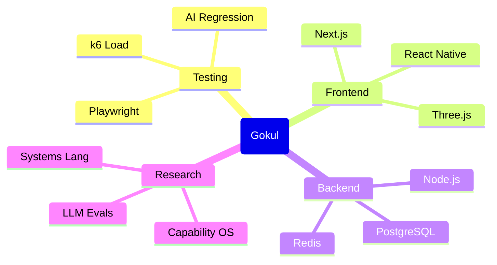

<!--
  🚀 GOKUL SENTHILKUMAR – PROFILE README v3
  Elite SDET + Full-Stack Engineer • Product & Testing Focused
-->

<div align="center">

  <h1 align="center">Gokul Senthilkumar</h1>
  
  <br/>

  <!-- Dynamic Animated Typing -->
  [](https://github.com/gokulsenthilkumar3)

  <br/>

  <!-- Social & Status Bar -->
  <p align="center">
    <a href="https://github.com/gokulsenthilkumar3">
      
    </a>
    <a href="mailto:gokulsenthilkumar3@gmail.com">
      
    </a>
    <a href="./PROFILE-SLIDES.md">
      
    </a>
    
  </p>

</div>

---

## 💎 Who I Am

<table>
  <tr>
    <td width="60%">

I am a **Software Development Engineer in Test (SDET)** and **Full‑Stack Developer** from Tamil Nadu, India 🇮🇳, building systems where **quality, performance, and developer experience** are first‑class features — not afterthoughts.

My work lives at the intersection of:

- **Product‑grade web apps** (finance, operations, management)
- **Testing and automation frameworks** (from UI to LLMs)
- **Performance, reliability, and observability**

If something ships with my name on it, it is: **measured, monitored, and battle‑tested**.

<br/>


  </td>
  <td width="40%" align="center">
    <a href="https://wakatime.com/@gokulsenthilkumar3">
      
    </a>
  </td>
  </tr>
</table>

---

## 🧭 What I Actually Do

- **Design full‑stack systems** from database schema and API contracts to clean, responsive UIs.
- **Engineer test architectures** that prevent regressions instead of just detecting them late.
- **Run performance experiments** using tools like **k6**, measuring how systems behave under load.
- **Turn business problems into tools** that people can actually live in every day (not just demo once).

```json
{
  "identity": "Gokul Senthilkumar",
  "roles": ["SDET", "Full-Stack Developer"],
  "location": "Sivanmalai, Tamil Nadu, India",
  "philosophy": "Precision in Testing, Excellence in Engineering",
  "stack_mastery": {
    "frontend": ["React", "Next.js", "Tailwind CSS"],
    "backend": ["Node.js", "Express.js", "REST APIs", "GraphQL"],
    "databases": ["PostgreSQL", "MongoDB", "MySQL", "Redis"],
    "testing": ["k6", "Selenium", "Cypress", "Azure DevOps Pipelines"]
  }
}
```

---

## 🚀 Flagship Builds (Real Problems, Real Systems)

These are the projects that best represent **what I can own end‑to‑end**:

- **[Portfolio](https://github.com/gokulsenthilkumar3/Portfolio)**  
  Next.js + TypeScript portfolio engineered like a product: SSR, performance‑first, and pixel‑perfect responsive design.

- **[Yarn‑Management](https://github.com/gokulsenthilkumar3/Yarn-Management)**  
  Production‑grade TypeScript app for textile yarn inventory and order management — built for **real business workflows**.

- **[VaultIQ](https://github.com/gokulsenthilkumar3/VaultIQ)**  
  Office asset management platform to track and assign hardware/software with live status and audit trails.

- **[NexFlow](https://github.com/gokulsenthilkumar3/NexFlow)**  
  Project management & helpdesk platform inspired by Azure DevOps/Zoho Desk — tickets, boards, sprints, and collaboration.

- **[Finance‑OxFin](https://github.com/gokulsenthilkumar3/Finance-OxFin)**  
  Personal finance dashboard in TypeScript for income/expense tracking, budgets, and investment visibility.

- **[MathShield‑CDN](https://github.com/gokulsenthilkumar3/MathShield-CDN)**  
  Next‑gen human verification layer using adaptive math challenges and behavioral signals — a smarter alternative to traditional CAPTCHA.

- **[ProbeAI](https://github.com/gokulsenthilkumar3/ProbeAI)**  
  An intelligent testing framework for **evaluating and benchmarking LLMs** — prompts, regressions, and quality metrics.

> If you want to understand how I think about architecture, testing, and maintainability, start with these.

---

## 🧬 Skill Topology



---

## 🧪 Testing & Quality Engineering Mindset

I don’t treat testing as a checkbox — it’s part of the **system design**.

- **Shift‑left mindset**: testability and observability are considered at design time, not “after MVP”.
- **Performance as a feature**: load tests with **k6** and similar tools to validate that systems don’t just work; they hold up.
- **Real‑world flows**: test scenarios are written from the perspective of **how users actually break things**, not just happy paths.
- **Tooling**: from UI automation (Selenium, Cypress) to LLM test harnesses (ProbeAI) and API contract verification.

If you care about **not being paged at 3am**, we’re already aligned.

---

## 🔬 Research

<details>
<summary>Research Lab — Click to enter</summary>

```text
$ gokul --research status

[OS]   CapabilityKernel v0.3-alpha
       ├─ Threat Model: ████████░░ 80%
       ├─ Microkernel RFC: ██████░░░░ 60%
       └─ AI Scheduler: ████░░░░░░ 40%

[LANG] GradualSys v0.1-spec
       ├─ Type System: ██████████ 100%
       ├─ Compiler Design: █████░░░░░ 50%
       └─ Package Manager: ███░░░░░░░ 30%
```

</details>

---

## 📊 Engineering Activity & Stats

<div align="center">
  <table>
    <tr>
      <td width="50%">
        
      </td>
      <td width="50%">
        
      </td>
    </tr>
    <tr>
      <td colspan="2" align="center">
        <br/>
        
      </td>
    </tr>
  </table>
</div>

---

## 🐍 Contributions in Motion

<div align="center">
  <br/>
  <picture>
    <source media="(prefers-color-scheme: dark)" srcset="https://raw.githubusercontent.com/gokulsenthilkumar3/gokulsenthilkumar3/output/github-contribution-grid-snake-dark.svg">
    
  </picture>
  <br/><br/>
  
</div>

---

## 🧠 Problem Solving & Competitive Coding

<div align="center">
  <br/>
  
</div>

---

## 📬 Let’s Build Something Serious

- 💼 Open to roles where **testing + architecture** are both important  
- 🧪 Happy to discuss **SDET strategy, performance testing, and LLM evaluation**  
- 🧱 Also interested in **long‑term product building** (internal tools, platforms, and real business workflows)

**Reach out:**  
`gokulsenthilkumar3@gmail.com`  

<div align="center">

  <br/>

  <!-- Footer Banner -->
  

  <p align="center">
    <i>"Automating the present, engineering the future."</i>
  </p>

  [⭐ Star my repositories](https://github.com/gokulsenthilkumar3?tab=repositories) ·
  [🧭 Explore my work](https://github.com/gokulsenthilkumar3?tab=repositories)

  <br/><br/>

</div>
