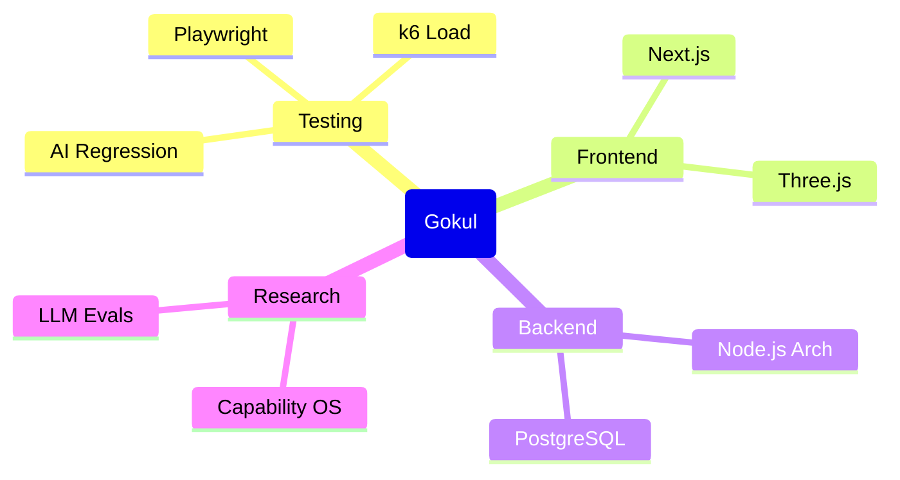

<!-- markdownlint-disable MD033 MD041 -->

<div align="center">
  
</div>

<div align="center">
  <h3>ENGINEERING EXCELLENCE &bull; SYSTEMS ARCHITECTURE &bull; QUALITY ASSURANCE</h3>
  
  <br/>

  <a href="https://github.com/gokulsenthilkumar3">
    
  </a>
</div>

<p align="center">
  <a href="mailto:gokulsenthilkumar3@gmail.com"></a>
  <a href="https://linkedin.com/in/gokulsenthilkumar3"></a>
</p>

<br/>

---

##  The Architect's Vision

I operate at the rare intersection of **Advanced System Architecture** and **Enterprise-Grade Quality Assurance**. As an SDET and Full-Stack Developer, my philosophy is simple: *software should not just work; it must be unshakeable.*

From orchestrating highly concurrent microservices to developing AI-native test frameworks, I build systems where performance, security, and developer experience are foundational, not afterthoughts.

> **Current Frontier:** AI-Native Automation & Advanced Observability.

<details open>
<summary><b> System Identity Payload (Click to collapse)</b></summary>

```json
{
  "entity": "Gokul Senthilkumar",
  "designation": ["SDET", "Full-Stack Architect"],
  "location": "Tamil Nadu, India",
  "operating_principle": "Precision in Testing, Excellence in Engineering",
  "status": "Compiling the Future"
}
```

</details>

---

<div align="center">
  <h2> The Technology Matrix</h2>
  <br/>
  
  <table>
    <tr align="center">
      <td width="33%"><b>Frontend & Backend</b></td>
      <td width="33%"><b>Infrastructure & Data</b></td>
      <td width="33%"><b>Testing & DevOps</b></td>
    </tr>
    <tr align="center">
      <td></td>
      <td></td>
      <td></td>
    </tr>
  </table>
</div>

---

##  Flagship Engineering (Real Problems, Real Systems)

<table>
  <tr>
    <td width="50%" valign="top">
      <h3><a href="https://github.com/gokulsenthilkumar3/Portfolio">🎨 The Portfolio Platform</a></h3>
      <p>A Next.js & TypeScript architecture engineered like a consumer product. Features Server-Side Rendering, a performance-first mindset, and pixel-perfect design.</p>
      
      
    </td>
    <td width="50%" valign="top">
      <h3><a href="https://github.com/gokulsenthilkumar3/Yarn-Management">🧵 Enterprise Yarn-Management</a></h3>
      <p>A production‑grade TypeScript ecosystem designed for textile inventory and high-throughput order management. Built for complex, real-world business workflows.</p>
    </td>
  </tr>
  <tr>
    <td width="50%" valign="top">
      <h3><a href="https://github.com/gokulsenthilkumar3/NexFlow">🌊 NexFlow</a></h3>
      <p>A robust project management and helpdesk orchestration platform inspired by Azure DevOps. Features live ticket tracking, sprint boards, and seamless collaboration.</p>
    </td>
    <td width="50%" valign="top">
      <h3><a href="https://github.com/gokulsenthilkumar3/VaultIQ">🔐 VaultIQ</a></h3>
      <p>Secure office asset management system engineered to track hardware/software assignments with cryptographically inspired audit trails and live status monitoring.</p>
    </td>
  </tr>
  <tr>
    <td width="50%" valign="top">
      <h3><a href="https://github.com/gokulsenthilkumar3/ProbeAI">🤖 ProbeAI Framework</a></h3>
      <p>An intelligent, highly scalable testing framework designed specifically for evaluating and benchmarking Large Language Models, prompt regression, and deterministic quality metrics.</p>
    </td>
    <td width="50%" valign="top">
      <h3><a href="https://github.com/gokulsenthilkumar3/MathShield-CDN">🛡️ MathShield-CDN</a></h3>
      <p>A next‑generation human verification layer utilizing adaptive cryptographic math challenges and behavioral signals to replace legacy CAPTCHA systems.</p>
    </td>
  </tr>
</table>

> *True engineering is measured by how a system behaves when things go wrong. Dive into these repositories to see my approach to resilience.*

---

##  The Quality Engineering Mandate

I do not treat testing as a post-development chore. It is the absolute core of **system design**.

- **Shift‑Left Philosophy**: Observability and testability are engineered into the architecture at phase zero.
- **Performance as a Core Feature**: Systems are subjected to rigorous stress tests (via k6) to ensure they scale gracefully under pressure.
- **Chaos & Real-World Flows**: Automated scenarios are designed to simulate how real users actually break things, not just happy paths.

> 💡 *If you value engineering that lets you sleep at night, we speak the same language.*

---

##  Mental Map

<div align="center">


```mermaid
mindmap
  root("Gokul")
    Testing
      Playwright
      k6 Load
      AI Regression
    Frontend
      Next.js
      Three.js
    Backend
      Node.js Arch
      PostgreSQL
    Research
      Capability OS
      LLM Evals
```

</div>

---

##  Algorithmic Dominance

<div align="center">
  <picture>
    <source media="(prefers-color-scheme: dark)" srcset="https://leetcard.jacoblin.cool/P2zYBiCLzn?theme=dark&font=Fira+Code&ext=heatmap">
    <source media="(prefers-color-scheme: light)" srcset="https://leetcard.jacoblin.cool/P2zYBiCLzn?theme=light&font=Fira+Code&ext=heatmap">
    
  </picture>
</div>

---

##  Deep Research Lab

<details open>
<summary><b>Access Secure Terminal (Click to toggle)</b></summary>

```text
$ gokul --research status

[OS]   CapabilityKernel v0.3
       ├─ Threat Model: 80% [████████░░]
       ├─ Microkernel:  60% [██████░░░░]
       └─ AI Scheduler: 40% [████░░░░░░]

[LANG] GradualSys v0.1
       ├─ Type System:  100% [██████████]
       ├─ Compiler:     50%  [█████░░░░░]
       └─ Pkg Manager:  30%  [███░░░░░░░]
```

</details>

---

##  Analytics & Continuous Output

<div align="center">
  <picture>
    <source media="(prefers-color-scheme: dark)" srcset="./assets/stats/github-stats-dark.svg">
    <source media="(prefers-color-scheme: light)" srcset="./assets/stats/github-stats-light.svg">
    
  </picture>
  &nbsp;
  <picture>
    <source media="(prefers-color-scheme: dark)" srcset="./assets/stats/top-langs-dark.svg">
    <source media="(prefers-color-scheme: light)" srcset="./assets/stats/top-langs-light.svg">
    
  </picture>
  
  <br/><br/>
  
  <picture>
    <source media="(prefers-color-scheme: dark)" srcset="./assets/stats/wakatime-dark.svg">
    <source media="(prefers-color-scheme: light)" srcset="./assets/stats/wakatime-light.svg">
    
  </picture>

  <br/><br/>

  <!-- Snake Animation -->
  <picture>
    <source media="(prefers-color-scheme: dark)" srcset="https://raw.githubusercontent.com/gokulsenthilkumar3/gokulsenthilkumar3/output/github-contribution-grid-snake-dark.svg">
    <source media="(prefers-color-scheme: light)" srcset="https://raw.githubusercontent.com/gokulsenthilkumar3/gokulsenthilkumar3/output/github-contribution-grid-snake.svg">
    
  </picture>
</div>

---

<div align="center">
  <h2>Let’s Build The Impossible.</h2>
  <p>Seeking opportunities where <b>testing + elite architecture</b> are non-negotiable standards.</p>
  
  <a href="mailto:gokulsenthilkumar3@gmail.com">
    
  </a>
  <br/><br/>

  <p><i>"Automating the present, architecting the future."</i></p>

  <p>
    <a href="https://github.com/gokulsenthilkumar3?tab=repositories">⭐ Audit my repositories</a> &bull;
    <a href="https://github.com/gokulsenthilkumar3?tab=repositories">🧭 Explore my infrastructure</a>
  </p>

  
</div>
